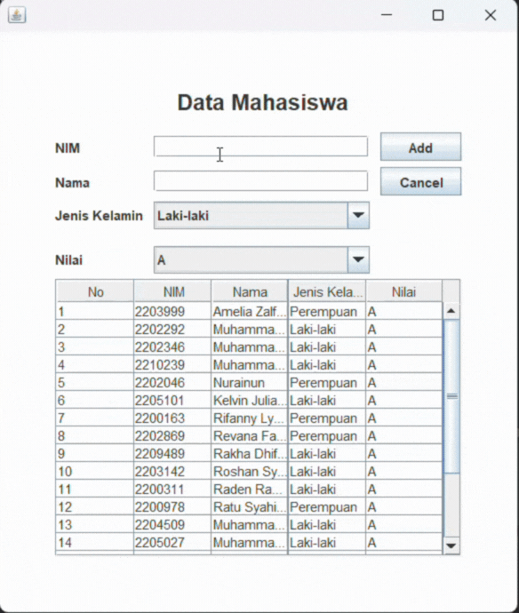

# TP5DPBO2025C1

Saya Rexy Putra Nur Laksana dengan NIM 2309578 mengerjakan soal TP 5 dalam mata kuliah Desain dan Pemrograman Berorientasi Objek untuk keberkahanNya maka saya tidak melakukan kecurangan seperti yang telah dispesifikasikan. Aamiin.

# Desain Program
- **Input Form** :
  - **NIM**: Input field untuk memasukkan Nomor Induk Mahasiswa  
  - **Nama**: Input field untuk memasukkan nama mahasiswa  
  - **Jenis Kelamin**: Dropdown untuk memilih jenis kelamin  
  - **Nilai**: Dropdown untuk memilih nilai mahasiswa
  - **Tombol Add**: Untuk menambahkan input data  
  - **Tombol Update**: Untuk mengupdate input data  
  - **Tombol Delete**: Untuk mendelete input data  
  - **Tombol Cancel**: Untuk membatalkan aksi add, update atau delete  

- **Tabel Mahasiswa**:  
  - Menampilkan daftar mahasiswa dengan kolom **No, NIM, Nama, Jenis Kelamin, dan Nilai**  
  - Data di tabel diperbarui secara otomatis setiap kali ada perubahan seperti Add, Update, Delete

- **Class**
  - **Menu** : aplikasi GUI berbasis Java Swing untuk mengelola data mahasiswa menggunakan fitur CRUD (Create, Read, Update, Delete). Data mahasiswa disimpan dalam database dan ditampilkan dalam JTable. Pengguna dapat menambahkan, mengedit, dan menghapus data dengan validasi yang sesuai. Program juga mendukung interaksi melalui tombol dan klik pada tabel untuk memperbarui informasi. 
  - **Mahasiswa** :  kelas model yang merepresentasikan data mahasiswa dengan atribut NIM, nama, jenis kelamin, dan nilai. Kelas ini menyediakan constructor untuk inisialisasi data, serta getter dan setter untuk mengakses dan mengubah nilai atribut.
  - **Database** : Kelas Database berfungsi sebagai penghubung antara aplikasi dan database MySQL. Kelas ini menangani koneksi ke database, serta menyediakan metode untuk menjalankan query SELECT, INSERT, UPDATE, dan DELETE menggunakan JDBC.

# Alur
### 1. **Inisialisasi Program**

- Program dimulai dengan membuat objek Menu, mengatur ukuran dan tampilan jendela, serta menampilkan GUI menggunakan JFrame.

### 2. **Inisialisasi Komponen GUI**

- Tabel (JTable): Menampilkan daftar mahasiswa.
- Form Input (JTextField, JComboBox): Untuk mengisi data mahasiswa (NIM, Nama, Jenis Kelamin, Nilai).
- Tombol (JButton):
  - "Add/Update" → Menambahkan atau memperbarui data.
  - "Delete" → Menghapus data.
  - "Cancel" → Mengosongkan form.

### 3. **Mengambil Data dari Database**

- Data mahasiswa diambil dari database menggunakan query SELECT * FROM mahasiswa.
- Data yang diperoleh kemudian ditampilkan dalam tabel (JTable).

## 4. **Interaksi Pengguna**

- Tambah Data
  - Pengguna mengisi form dan menekan tombol "Add".
  - Program memvalidasi input, mengecek apakah NIM sudah ada.
  - Jika valid, data disimpan ke database (INSERT INTO mahasiswa).
  - Tabel diperbarui, dan form dikosongkan.
- Pilih Data di Tabel
  - Jika baris tabel diklik, form akan terisi dengan data dari baris tersebut.
  - Tombol "Add" berubah menjadi "Update", dan tombol "Delete" ditampilkan.
- Edit Data
  - Jika tombol "Update" ditekan, data mahasiswa di dalam Database diperbarui sesuai input form.
  - Tabel diperbarui, form dikosongkan, dan tombol kembali ke mode "Add".
- Hapus Data
  - Jika tombol "Delete" ditekan, program meminta konfirmasi.
  - Jika disetujui, data dihapus dari Database, tabel diperbarui, dan form dikosongkan.
- Batalkan Aksi
  - Jika tombol "Cancel" ditekan, semua input di form dikosongkan dan tombol kembali ke mode "Add".

### 5. **Pembaruan Tampilan**

- Setelah setiap aksi (Tambah, Edit, Hapus), tabel diperbarui dengan data terbaru dari Database.

### 6.**Program Berjalan Hingga Ditutup**

- Program terus berjalan hingga jendela ditutup (JFrame.EXIT_ON_CLOSE).

# Dokumentasi
---

## CRUD

## ERROR

